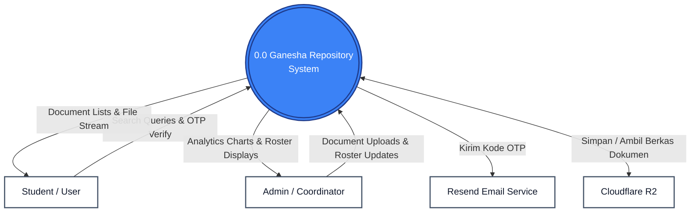

# System Context Diagram (Context Level DFD) - Ganesha Repository

The Context Diagram represents the entire **Ganesha Repository System** as a single process, showing the boundaries of the system and its interactions with external entities.

---

## 1. Context Diagram (Blue / White Style)

---

## 2. Entity Descriptions

* **Student / User**: Queries documents, requests and verifies OTP codes to log in, and views PDF resources.
* **Admin / Coordinator**: Uploads materials, manages team permissions, creates webinars, and requests visitor analytics.
* **Resend Email Service**: An external API that sends OTP authentication emails.
* **Cloudflare R2**: An S3-compatible cloud object store where PDF documents and thumbnail files are hosted.
