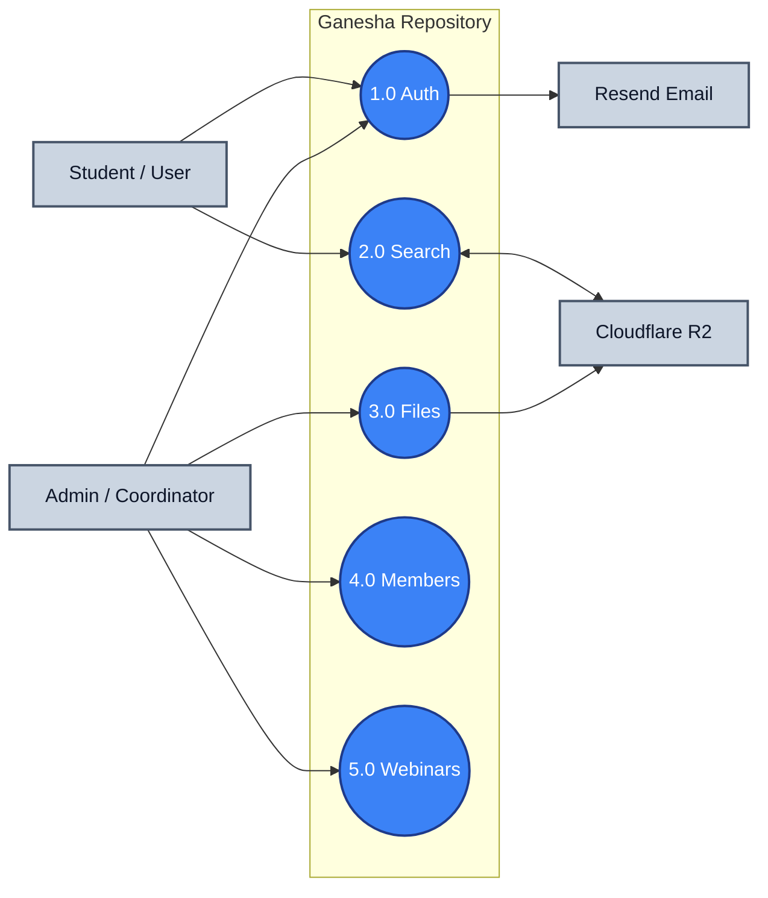

# Data Flow Diagram Level 0 (DFD Level 0) - Simplified

A highly simplified DFD showing the Ganesha Repository system's 5 core processes organized in a Left-Center-Right layout.

---

## 1. Simplified DFD Level 0 Diagram

---

## 2. Description of Connections

* **Student / User & Admin** connect to **1.0 Auth** to log in, which sends OTP requests to **Resend Email**.
* **Student / User** connects to **2.0 Search** to find and view materials fetched from **Cloudflare R2**.
* **Admin** connects to **3.0 Files** to upload materials directly to **Cloudflare R2**.
* **Admin** connects to **4.0 Members** to manage staff roles, and **5.0 Webinars** to schedule webinars and view logs.
