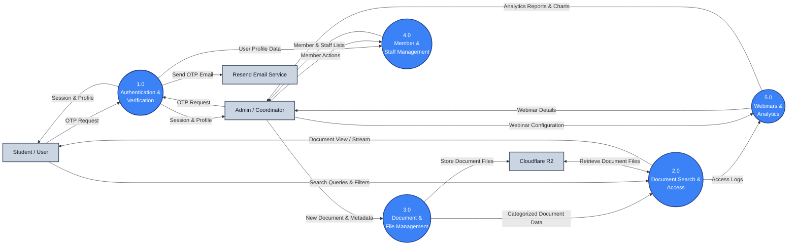

# Data Flow Diagram Level 1 (DFD Level 1) - Ganesha Repository

The Level 1 Data Flow Diagram breaks down the main system into five key sub-processes (1.0 to 5.0) to illustrate how data flows between processes, external entities, and data storage.

## 1. Main Processes (Level 1)
- **1.0 Authentication & Verification**: Manages user registration, login codes (OTP) dispatch, and session authorization for both students and admins.
- **2.0 Document Search & Access**: Handles search queries, category/major filtering, and secure rendering of documents for readers.
- **3.0 Document & File Management**: Processes new document uploads, metadata additions, descriptions, and file deletions by admins.
- **4.0 Member & Staff Management**: Manages user promotions from standard students to coordinators/staff, and handles demotions.
- **5.0 Webinars & Analytics**: Manages study room webinars creation, updates, and compiles visitor logs into visual analytics dashboards.

---

## 2. DFD Level 1 Diagram

---

## 3. Description of Inter-process Data Flows

Similar to how a Level 1 DFD shows data exchanging between processes (e.g., transferring verified vendor/product data), Ganesha Repository uses the following inter-process flows:

1. **Flow from 1.0 to 4.0 (*User Profile Data*)**: 
   * Once authentication succeeds in **1.0**, user details are passed to **4.0** to verify the user's role and populate the staff roster/permissions list.
2. **Flow from 3.0 to 2.0 (*Categorized Document Data*)**: 
   * When an admin uploads or edits materials in **3.0**, the structured document records are instantly routed to **2.0** so they are immediately searchable by students.
3. **Flow from 2.0 to 5.0 (*Access Logs*)**: 
   * Every search request or document view event captured in **2.0** generates a log entry, which flows into **5.0** to populate the system's analytics metrics.
