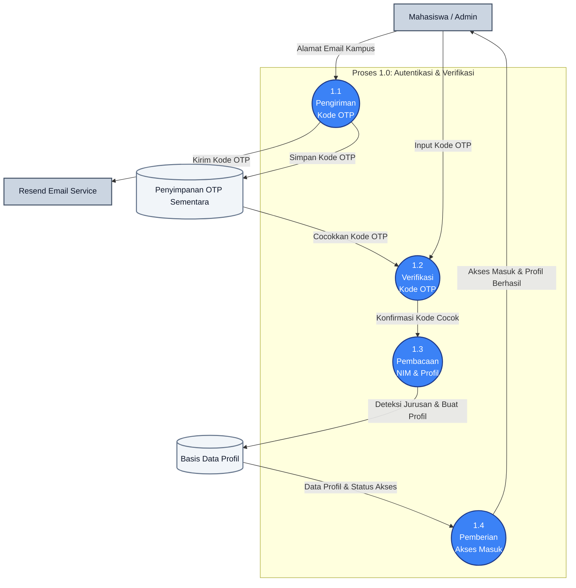

# DFD Level 2: Proses 1.0 (Autentikasi & Verifikasi)

Dokumen ini memecah proses utama **1.0 Autentikasi & Verifikasi** menjadi langkah-langkah detail (sub-proses 1.1 sampai 1.4) untuk memodelkan pengiriman OTP, verifikasi kode, pengenalan profil otomatis lewat NIM, hingga pemberian izin masuk sistem.

---

## 1. Gambar DFD Level 2 (Proses 1.0)

---

## 2. Penjelasan Detil Aliran Data

* **Proses 1.1 (Pengiriman Kode OTP)**: Pengguna (Mahasiswa atau Admin) memasukkan alamat email resmi mereka. Sistem menghasilkan kode angka acak sekali pakai, mengirimkannya ke email tujuan lewat **Resend Email Service**, serta menyimpannya ke **Penyimpanan OTP Sementara**.
* **Proses 1.2 (Verifikasi Kode OTP)**: Pengguna memasukkan kode OTP yang mereka terima dari kotak masuk email. Sistem mengambil data dari **Penyimpanan OTP Sementara** untuk mencocokkan nilainya. Jika sesuai, sistem mengizinkan proses berlanjut.
* **Proses 1.3 (Pembacaan NIM & Profil)**: Begitu email terverifikasi, sistem membaca kode digit NIM pengguna. Karakter digit NIM tersebut digunakan untuk mengidentifikasi fakultas/jurusan secara otomatis dan menyimpannya di **Basis Data Profil** (jika baru pertama kali mendaftar).
* **Proses 1.4 (Pemberian Akses Masuk)**: Sistem membaca data profil yang telah tersimpan di **Basis Data Profil** untuk memeriksa apakah pengguna adalah Mahasiswa biasa atau Admin/Pengurus, lalu menyerahkan izin akses masuk agar pengguna dapat melihat halaman dashboard utama.
