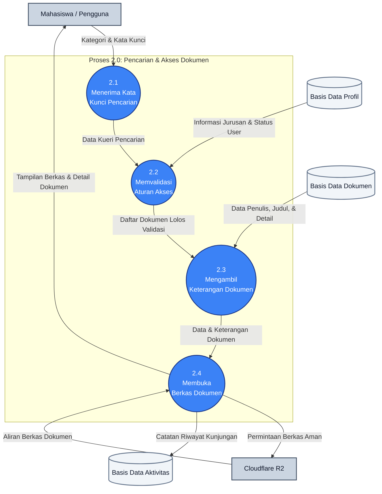

# DFD Level 2: Proses 2.0 (Pencarian & Akses Dokumen)

Dokumen ini memecah proses utama **2.0 Pencarian & Akses Dokumen** menjadi bagian-bagian yang lebih detail (sub-proses 2.1 sampai 2.4) untuk menggambarkan bagaimana data mengalir antara mahasiswa, basis data internal, dan penyimpanan berkas cloud.

---

## 1. Gambar DFD Level 2 (Proses 2.0)

---

## 2. Penjelasan Detil Aliran Data

* **Proses 2.1 (Menerima Kata Kunci Pencarian)**: Mahasiswa memasukkan kategori dokumen, jurusan, atau kata kunci pencarian. Data pencarian ini diteruskan ke proses penyaringan selanjutnya.
* **Proses 2.2 (Memvalidasi Aturan Akses)**: Sistem mencocokkan asal jurusan atau tingkat akses mahasiswa (diambil dari **Basis Data Profil**) dengan aturan privasi dokumen. Hanya dokumen yang diperbolehkan untuk jurusan mahasiswa tersebut yang akan diloloskan ke proses berikutnya.
* **Proses 2.3 (Mengambil Keterangan Dokumen)**: Mengambil data deskripsi lengkap dokumen (seperti nama penulis, tahun rilis, deskripsi singkat) dari **Basis Data Dokumen** untuk dipersiapkan ke tampilan layar.
* **Proses 2.4 (Membuka Berkas Dokumen)**: Ketika mahasiswa mengklik dokumen untuk membacanya, sistem meminta berkas PDF dari **Cloudflare R2** secara aman, menampilkannya ke layar mahasiswa, serta mencatat riwayat kunjungan mahasiswa tersebut ke **Basis Data Aktivitas** untuk kebutuhan statistik pengurus.
