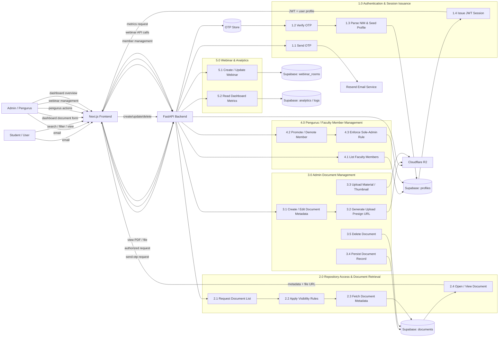

# Ganesha Repository Level 2 Data Flow Diagram

## Notes

- The diagram reflects the current frontend and backend routing in this project.
- `documents` stores both file-backed and link-backed materials, while `material_type` determines how the viewer opens them.
- `profiles` is the source of truth for role, faculty, and major.
- `OTP Store` is in-memory in the current backend implementation.
- The dashboard and repository views are protected by frontend route guards plus backend authorization checks.
