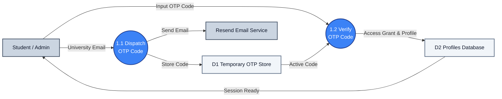

# DFD Process 1.0: Authentication & Verification

A simplified DFD showing the core OTP dispatch and verification flows.

---

## 1. Process 1.0 Diagram

---

## 2. Key Data Flows

* **1.1 Dispatch OTP Code**: Takes the user's email, writes a temporary code to **D1**, and triggers **Resend** to send the email.
* **1.2 Verify OTP Code**: Verifies the input code against **D1**, updates the student session status in **D2**, and grants dashboard access back to the user.
