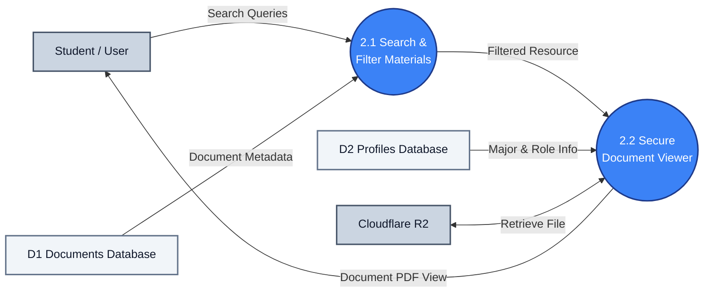

# DFD Process 2.0: Document Search & Access

A simplified DFD showing how documents are searched and securely rendered.

---

## 1. Process 2.0 Diagram

---

## 2. Key Data Flows

* **2.1 Search & Filter Materials**: Takes student search queries and displays matching metadata from **D1**.
* **2.2 Secure Document Viewer**: Compares the student's profile eligibility from **D2** (visibility rules) and fetches the physical PDF from **Cloudflare R2** to render inside the secure viewer.
