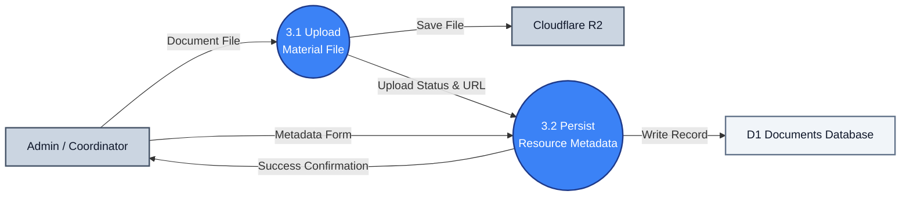

# DFD Process 3.0: Document & File Management

A simplified DFD showing how documents are uploaded, processed, and persisted.

---

## 1. Process 3.0 Diagram

---

## 2. Key Data Flows

* **3.1 Upload Material File**: Transfers raw PDF materials and thumbnails directly from the admin to **Cloudflare R2** and receives the final file location.
* **3.2 Persist Resource Metadata**: Saves the descriptive details (title, author, course) alongside the Cloudflare URL into **D1**, notifying the admin of a successful upload.
