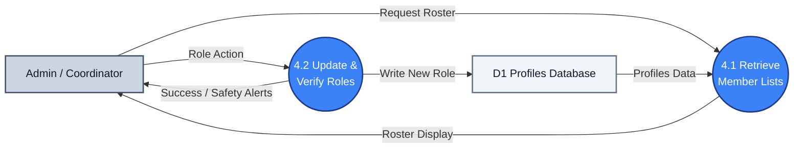

# DFD Process 4.0: Member & Staff Management

A simplified DFD showing how member lists are loaded and roles are verified and updated.

---

## 1. Process 4.0 Diagram

---

## 2. Key Data Flows

* **4.1 Retrieve Member Lists**: Pulls names, registration times, and roles from **D1** to display the active list to the administrator.
* **4.2 Update & Verify Roles**: Changes a member's status (promoting or demoting) while making sure at least one active admin is always preserved in **D1**.
