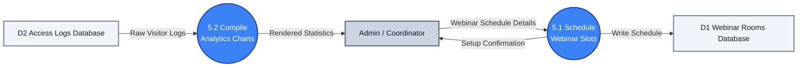

# DFD Process 5.0: Webinars & Analytics

A simplified DFD showing how webinars are scheduled and visitor access charts are generated.

---

## 1. Process 5.0 Diagram

---

## 2. Key Data Flows

* **5.1 Schedule Webinar Slots**: Takes webinar title, timing, and meeting links from the coordinator and saves the schedule to **D1**.
* **5.2 Compile Analytics Charts**: Pulls access history from **D2** (views count, login frequency) to present visual charts and activity metrics to the admin.
